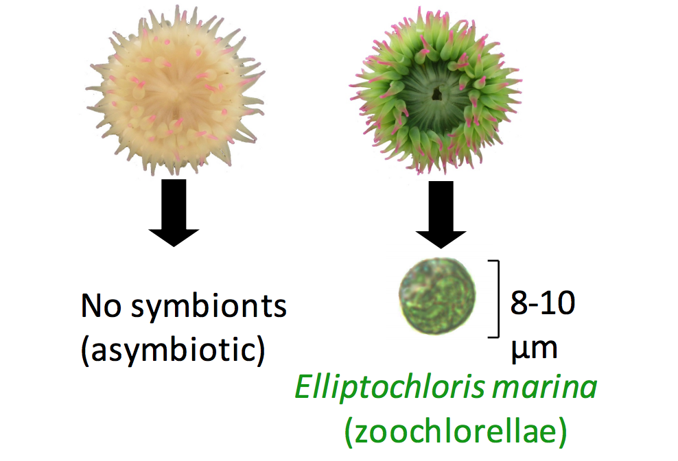

# Are differential DNA methylation and alternative splicing associated with symbiosis in a sea anemone?

Symbiosis with dinoflagellates and other algae is widespread among cnidarians such as corals and sea anemones. Symbiosis in these organisms is associated with physiological changes that are in turn driven by changes in gene expression. Recent studies have also identified changes in DNA methylation patterns that may be driven by symbiosis. While it is still unclear exactly how methylation may influence gene expression, there is support for a role of DNA methylation in alternative mRNA splicing shown in other systems. This project will test the hypothesis that the symbiotic phenotype is associated with differential DNA methylation and alternative splicing. The project will leverage the full length mRNA reads and sensitivity to base modifications possible using nanopore sequencing.

Samples: n= 3 aposymbiotic and n= 3 symbiotic _Anthopleura elegantissima_ hosting the chlorophyte _Elliptochloris marina_. Specimens were collected within ~10 cm of each other on the underside of a boulder, and likely represent a single clone. Specimens were flash frozen within one hour of collection. This choice of samples should minimize environmental and genetic effects.

# Methods overview

Step 1: Sequence DNA using Oxford Nanopore Ligation Sequencing Kit and 3 MinION flow cells (2 sea anemones multiplexed per flow cell, expected data output ~8 gb per flow cell, approx. 10x genome coverage per anemone).

Step 2: Sequence RNA using Oxford Nanopore cDNA-PCR Sequencing Kit and 3 MinION flow cells (2 sea anemones multiplexed per flow cell, expected data output ~8 gb per flow cell, approx. 6-10 million reads per flow cell).

Step 3: Generate A. elegantissima draft genome.

Step 4: Generate list of target symbiosis-influenced genes identified in previous studies and map to the genome to identify introns and exons and develop gene models. Use these gene models as reference for further mapping.

Step 5: Map cDNA reads to gene models to identify alt splicing.

Step 6: Map DNA reads to gene models and call methylation using nanopolish.  

## Library preparation and sequencing

DNA libraries were prepared according to the [Oxford Nanopore Ligation Sequencing with Native Barcoding protocol](./1D-Native-barcoding-genomic-DNA-with-EXP-NBD103-and-SQK-LSK109.pdf). Libraries were sequenced in duplex (two barcoded samples per library) on three FLO-MIN106 MinION flow cells. Additionally, one asymbiotic specimen was also prepared according to the [Oxford Nanopore Rapid Sequencing protocol](./rapid-sequencing-sqk-rad004-RSE_9046_v1_revB_17Nov2017.pdf). Libraries were sequenced on two FLO-MIN106 MinION flow cells. The data produced from the Rapid Sequencing libraries were used only for genome assembly and not methylation analysis.

Poly-A mRNA libraries were prepared according to the [Oxford Nanopore cDNA PCR Barcoding protocol](./cDNA-PCR-Barcoding-SQK-PCS108-with-SQK-PBK004.pdf). Libraries were sequenced in duplex (two barcoded samples per library) on three FLO-MIN106 MinION flow cells.

## Genome assembly 

A draft _A. elegantissima_ genome was generated using [wtdbg2](https://github.com/ruanjue/wtdbg2). The draft genome comprises 243 Mb, including 5359 contigs with an N50 of 87 kb and N90 of 19.2 kb. 

## Analysis 

## Software

This study made use of the following software:

#### R packages:

## Directory structure

`analyses/` - Files resulting from ipyrad assembly and R analyses.

`data/` -  Metadata and links to methods and raw data.

`images/` - Coral photos, gel images, figures.

`notebooks/` - Jupyter notebooks.

`scripts/` - Scripts such as R scripts used for analyses.
